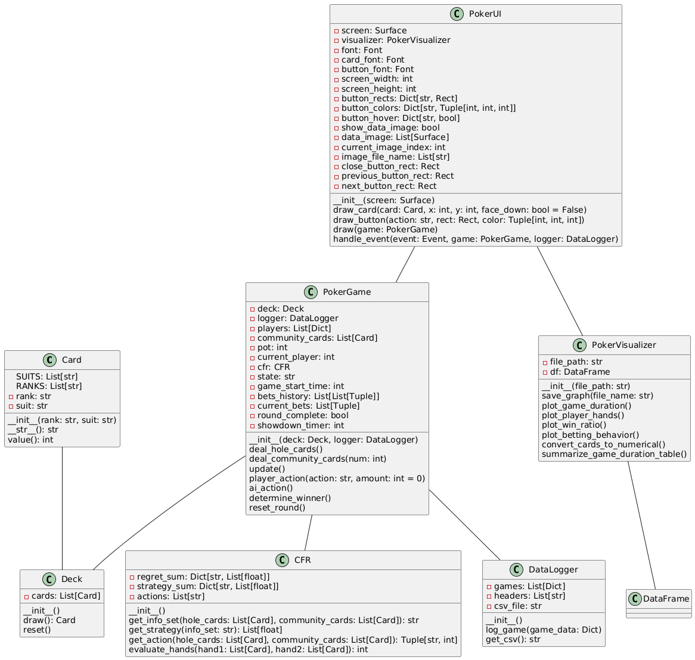

# PokerHands
A simple Plaver VS Bot Python-based poker game that determines the best hand among players. This project utilizes Pygame for the graphical interface and implements core poker logic to evaluate hand rankings.
# Project VERSION 1.0


## Installation

1. Clone the Repository:
```sh
git clone https://github.com/PakornF/pokerhands.git
cd pokerhands
```
2. Install Required Packages
```sh
pip install -r requirements.txt
```

## Gameplay Instruction
- Starting the Game: Type this in the terminal to launch the game window.
  ```sh
  game.py
  ```
- Player Actions: Use the on-screen buttons or keyboard inputs to perform actions.
- Winning: The game evaluates all hands and declares the winner at the end of each round.

## Project Structure
- cards.py: Contains classes and functions related to card representations.
- cfr.py: Implements the Counterfactual Regret Minimization(CFR) algorithm for strategy optimization.
- data.py: Manages data structures and utilities.
- game.py: Main game loop and event handling.
- gamelogic.py: Core logic for evaluating poker hands.
- ui.py: Handles the graphical user interface using Pygame.
- visualize.py: Functions for visualizing game data and statistics.
- game_data.csv: Dataset after collecting

## UML Class Diagram



## License
MIT License

Copyright (c) 2025 PakornF

Permission is hereby granted, free of charge, to any person obtaining a copy
of this software and associated documentation files (the "Software"), to deal
in the Software without restriction, including without limitation the rights
to use, copy, modify, merge, publish, distribute, sublicense, and/or sell
copies of the Software, and to permit persons to whom the Software is
furnished to do so, subject to the following conditions:

The above copyright notice and this permission notice shall be included in all
copies or substantial portions of the Software.

THE SOFTWARE IS PROVIDED "AS IS", WITHOUT WARRANTY OF ANY KIND, EXPRESS OR
IMPLIED, INCLUDING BUT NOT LIMITED TO THE WARRANTIES OF MERCHANTABILITY,
FITNESS FOR A PARTICULAR PURPOSE AND NONINFRINGEMENT. IN NO EVENT SHALL THE
AUTHORS OR COPYRIGHT HOLDERS BE LIABLE FOR ANY CLAIM, DAMAGES OR OTHER
LIABILITY, WHETHER IN AN ACTION OF CONTRACT, TORT OR OTHERWISE, ARISING FROM,
OUT OF OR IN CONNECTION WITH THE SOFTWARE OR THE USE OR OTHER DEALINGS IN THE
SOFTWARE.

## Contact
Created by PakornF. Feel free to reach out for any questions or collaborations.