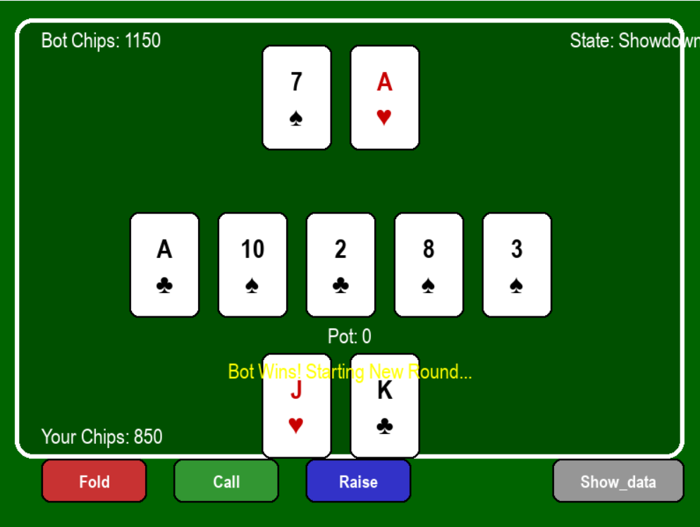

# Poker
A simple Plaver VS Bot Python-based poker game that determines the best hand among players. This project utilizes Pygame for the graphical interface and implements core poker logic to evaluate hand rankings.
# Project VERSION 1.0



## Installation

1. Clone the Repository:
```sh
git clone https://github.com/PakornF/pokerhands.git
cd pokerhands
```
2. Install Required Packages
```sh
pip install -r requirements.txt
```
3. Run Game
```sh
game.py
```
